**Professional management system for information management**

directory

[1. Project Background](#project-background)

[2. Design Module](#design-module)

[2.1 Development tools and techniques](#development-tools-and-techniques)

[2.2 Analysis of key business requirements](#analysis-of-key-business-requirements)

[3. Database design](#database-design)

[3.1 Data requirements](#data-requirements)

[3.2 conceptual design](#conceptual-design)

[3.3 Logical design](#logical-design)

[4. Description of the function](#description-of-the-function)

[4.1 Functional module design](#functional-module-design)

[4.2 System flow diagram design](#system-flow-diagram-design)

[5. System implementation](#system-implementation)

[5.1 System login screen](#system-login-screen)

[5.2 Home page interface](#home-page-interface)

[5.3 Professional news interface](#professional-news-interface)

[5.4 Large job interface](#large-job-interface)

[5.5 Course management interface](#course-management-interface)

[5.6 Account management interface](#account-management-interface)

Account and password:

1)  Students: Account 101, Password 12345, Account 1121, Password 12345

2)  Teacher: Account 101, password 101101, account 102, password 102102

# Project Background

According to the development requirements, this website is mainly used
in teaching management, and completes the digital management of daily
educational work management courses, news releases, large assignments,
and student submissions. The development of this system can be more
systematic management of various services and information on teaching
affairs and teaching, and at the same time, it can greatly reduce the
cost of teaching, speed up the inquiry, strengthen the management and
the pace of informatization of various departments of the state, and
make the management more standardized.

With the widespread use of computers in China and the gradual
improvement of numerical management methods, more and more students are
gradually accustomed to using information technology to learn
information, which is also convenient for teachers to use information
technology to manage students. The application of information technology
in teaching management is the key to realize the scientific and modern
teaching management. Therefore, the website provides an efficient,
accurate and fast management mode for teaching management, and realizes
standardized and scientific management.

# Design Module 

## Development tools and techniques 

The information management professional system of this project is a
front-end and back-end separation of B/S architecture system
development, the front-end UI interface is implemented by vue, the
back-end development uses SpringBoot combined with the SpringMVC
architecture pattern, the back-end connection database uses the Mybatis
framework, combined with the SpringMVC architecture pattern, the
database design part uses MySQL, and the software used in the
development of the front-end and back-end is IntelliJ IDEA, the software
used to set up the database is Navicat.

1.  SpringBoot framework

Spring appeared in 2003, its advantages are mainly reflected in its
simplicity, testability, is a lightweight Java development framework,
and the extension of the Springboot framework is a further optimization
of Spring, under the premise that Spring can allow JavaBeans to
implement EJB functionality, Springboot can run Spring applications
faster with fewer configuration files.

2.  Mybatis Framework

Before the advent of MyBatis, it was cumbersome to use jdbc to operate
the database, and the conditional query statements were complex when
writing dynamic sql, which made the system development slow and
difficult to maintain. The Mybatis framework, on the other hand, is an
excellent persistence framework that requires little to no need to set
parameters and obtain the result set by ourselves, and only needs to be
mapped to the database record through simple XML or annotations,
interface mappings, and POJO configurations.

3.  SpringMVC architecture

MVC is an accepted software design specification that follows the rules
of separation of business from data and display. SpringMVC is a
request-and-response based part of Spring, a lightweight web framework
for MVC implemented through JAVA that allows users to get their work
done more efficiently.

4.  vue.js framework

vue.js is currently a very popular front-end framework, mainly designed
for bottom-up similar incremental development, it can easily implement a
lot of features, because its core library only focuses on the view
layer, which also makes it very easy to learn. At the same time, while
it is easy to operate, Vue.js is easy to integrate with other projects
or libraries.

## Analysis of key business requirements 

1.  Account Management

Account management means that users, i.e., students and teachers, have
the need to change the account password, so the system needs to provide
the function of changing the password, that is, through the user account
(student number or employee number), query and change the corresponding
password in the database.

2.  Professional news management

Professional journalism and courses are tied in a many-to-one
relationship. Teachers need to post news to students, only to taught
courses, students need to see news posted by teachers, only to view news
for selected courses, and teachers have requests to view posted news.
Therefore, the system needs to provide corresponding functions to screen
the news released by the teacher according to the teacher\'s job number
in the database, the scope of the teacher\'s news release according to
the course number of the course taught by the teacher, and the scope of
the news for students to view according to the course number of the
course selected by the student.

3.  Big job management

The assignment and the course are bound in a one-to-one relationship,
and the assignment is in file format. Teachers need to post large
assignments to students only to taught courses, students need to view
and submit large assignments posted by teachers, and can only work on
large assignments for selected courses; and teachers need to view and
download large assignments submitted by students. Therefore, in the
database, you need to filter the scope of teachers who publish and
download large assignments, and the scope of students who view and
submit large assignments based on the course number.

4.  Course Introduction Management

The course introduction and the course are bound in a one-to-one
relationship. Instructors need to view and edit class descriptions and
can only work on taught courses, while students need to view course
descriptions and can only view selected courses. Therefore, in the
database, you need to filter the scope of teachers viewing and modifying
course introductions and the scope of students viewing course
introductions based on the course number.

# Database design 

## Data requirements 

Data requirements analysis is mainly to clarify the attributes of the
object entities involved in the system and the content stored in the
database. The specific data requirements of the system are as follows:

(1) Professional news has a unique number as the primary key,
    professional news and courses are many-to-one relationships,
    professional news is released by teachers, and courses and teachers
    are many-to-many relationships, so it should also have course
    number, teacher work number, news title, news content, and release
    time attributes.

(2) The assignment has a unique number as the primary key, and the
    assignment has a one-to-one relationship with the course, so it
    should also have the attributes of the course number, assignment
    title, assignment requirements, release time, and deadline. In
    addition, there is a many-to-many relationship between students and
    assignments, so a table is also needed to show the relationship
    between students and assignments, with assignment number, student
    student number, assignment content (file storage address),
    submission time, and submission status (0 is not submitted, 1 is
    submitted).

(3) The course introduction belongs to the course information, which is
    a one-to-one relationship with the course and is one of the
    attributes of the course schedule.

## conceptual design 

Through analysis, it can be obtained that the system has the following
entities: student entity, teacher entity, course entity, professional
news entity (news), and large homework entity (project).

## Logical design 

Through entity attribute analysis, the relationship between entities can
be abstracted into the following relationship model, in which the
primary key of entity attribute is superscripted by horizontal lines,
and the foreign keys are represented by wavy lines. The specific
relationship model is as follows:

(1) Student information (student ID, student name, student gender,
    student account password)

(2) Teacher information (teacher ID, teacher name, teacher account
    password)

(3) Course information (course number, course name, course credits,
    course introduction)

(4) Faculty information (professor information number, faculty ID,
    course ID)

(5) Course selection information (course registration information
    number, student student number, course number)

(6) Professional news information (news number, news headline, news
    content, teacher number, course number, release time)

(7) Assignment information (assignment number, assignment title,
    assignment requirements, course number, release time, deadline)

(8) Submit assignment information (assignment number, student student
    ID, assignment content, submission time, submission status)

From the above design analysis, the E-R diagram can be obtained (Figure
3.1).

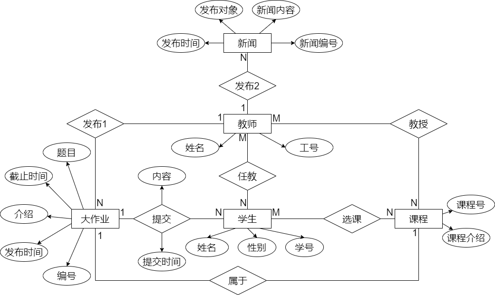

**Figure 3.1 E-R diagram**

# Description of the function 

## Functional module design 

Teacher users mainly have the following modules:

(1) Account Password: Change

(2) Pro News: View, Add

(3) Large jobs: view, add, and download

(4) Course Description: View

Student users mainly have the following modules:

(1) Account Password: Change

(2) Professional News: Check it out

(3) Large jobs: View and upload

(4) Course Description: View

> 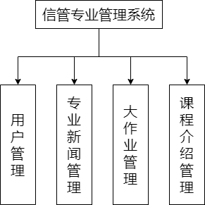

**Figure 4.1.1 System Functional Design Structure Diagram**

The detailed design of the module is described in the Release Big Job
section in the Big Job Management module as an example. Teachers can
only choose to publish large assignments to the courses they teach, and
the title, release object (course), detailed requirements, and deadline
of the large assignment are filled in or selected by the instructor, in
addition to this information, there is also the automatically obtained
publishing time sent from the front-end to the back-end, and the code of
VUE is shown in Figure 4.1.2. The backend Springboot Proj Controller has
a method forreceiving data from the frontend in the form of a custom
type SeeProj (Figure 4.1.3). ）。 The class calls the ddProj method in
the ProjDao interface (Figure 4.1.4), which carries parameters to
operate on the database through the SQL statement in ProjMapping .xml
and inserts large job data into the database (Figure 4.1.5).

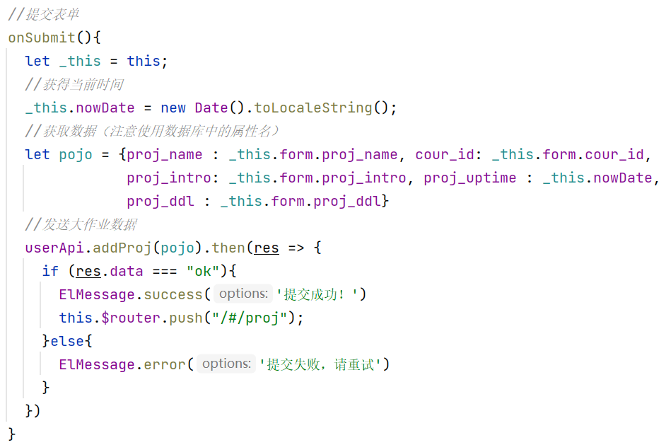

**Figure 41.2 The method of sending large job data to the backend in
vue**

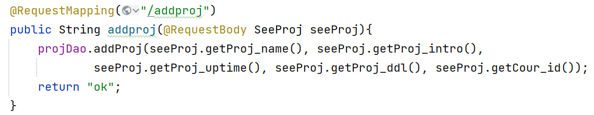

**Figure 41.3. Publish the controller class involved in the big job**

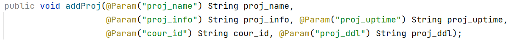

**Figure 41.4 Publish the method addProj in the ProjDao interface
involved in the big job**

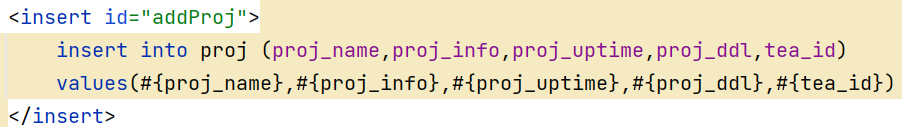

**Figure 4.1.5 SQL statements involved in publishing a large job**

## System flow diagram design 

The flowchart is also designed and analyzed from the perspective of two
roles, teacher users and student users, and the specific design is as
follows:

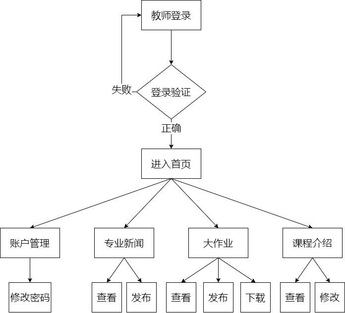

**Figure 4.2.1 Flowchart of Teacher User Functions**

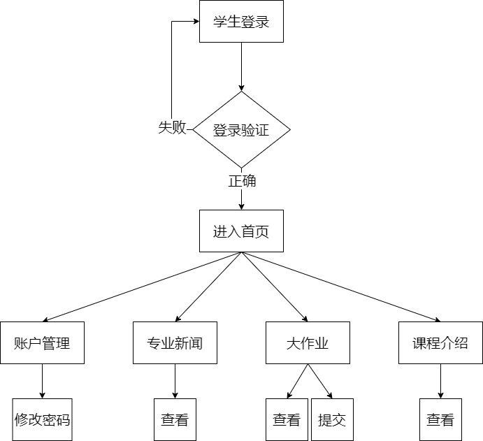

**Figure 4.2.2 Flowchart of Student User Functions**

# System implementation 

## System login screen 

The system login screen is logged in by the user (Figure 5.1.)1) Enter
the correct username and password to enter the system, after successful
login, the corresponding token will be generated according to the
student number or employee number, and the corresponding feedback will
be obtained if the input is wrong. The main backend controller layer
code for the feature implementation is shown in Figure 5.12。

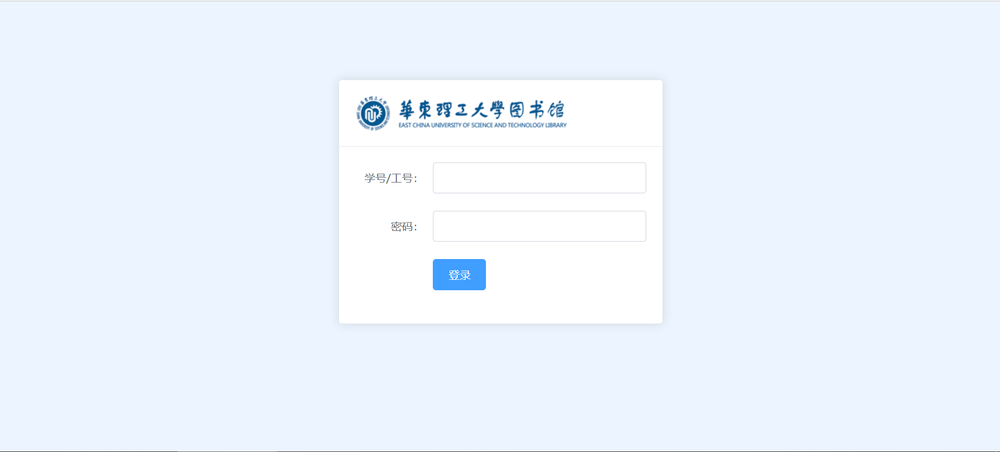

**Figure 5.12 Screenshot of the login screen**

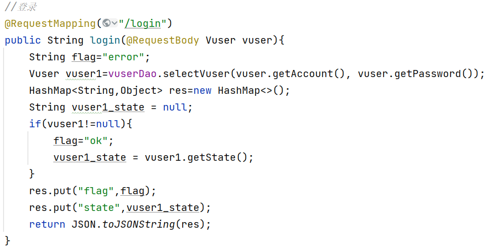

**Figure 5.12 Screenshot of the main backend controller layer code on
the login page**

## Home page interface 

> The home page interface is shown in Figure 52 shown.

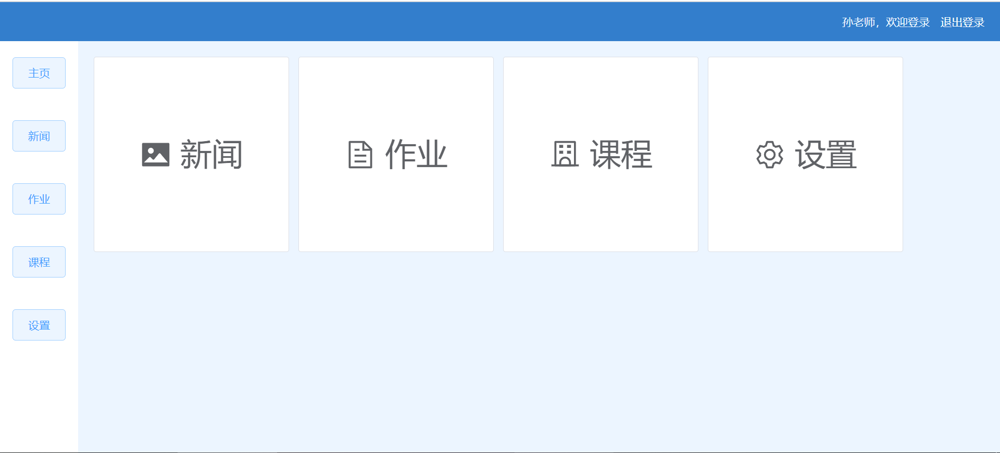**Figure 5.2 Screenshot of the home page**

## Professional news interface 

The professional news management module is shown in Figure 5.3.1. Each
piece of news is presented in the form of a card, showing the news
title, the publisher, the time of publication, and the content of the
news. The \"Post News\" button in the upper left corner is only visible
to teacher users and hidden from student users. Clicking on the card
will bring a pop-up window to show the details of the news, as shown in
Figure 5.3.2.

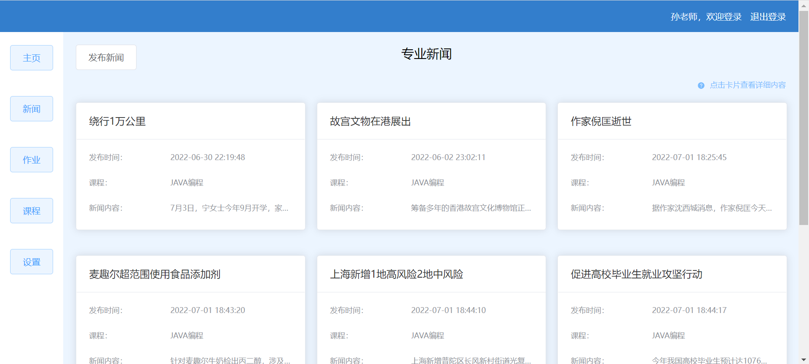

**Figure 5.3.1 Screenshot of the professional news interface**

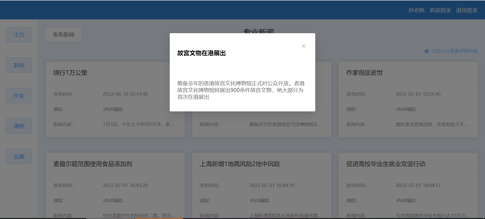

**Figure 5.3.2 Screenshot of the professional news pop-up window**

## Large job interface 

Figure 5.4.1 shows the student interface of the large homework
management module, and Figure 5.4 shows the teacher\'s interface2 shown.
The Post Large Assignment button in the upper left corner is visible
only to teacher users and hidden from student users. The student\'s card
shows the big assignment, and the card has a green or red label to show
the submission. Clicking on the card will have a pop-up window to submit
a large assignment, as shown in Figure 5.43. The table on the teacher\'s
side shows the submission of large assignments in each class, you can
see the title of the large assignment, the course to which it belongs
and the class submission, and click on the row of the table to see the
detailed submission of students, as shown in Figure 5.44. Figure 5.4.5
shows the page where the teacher publishes a large assignment.

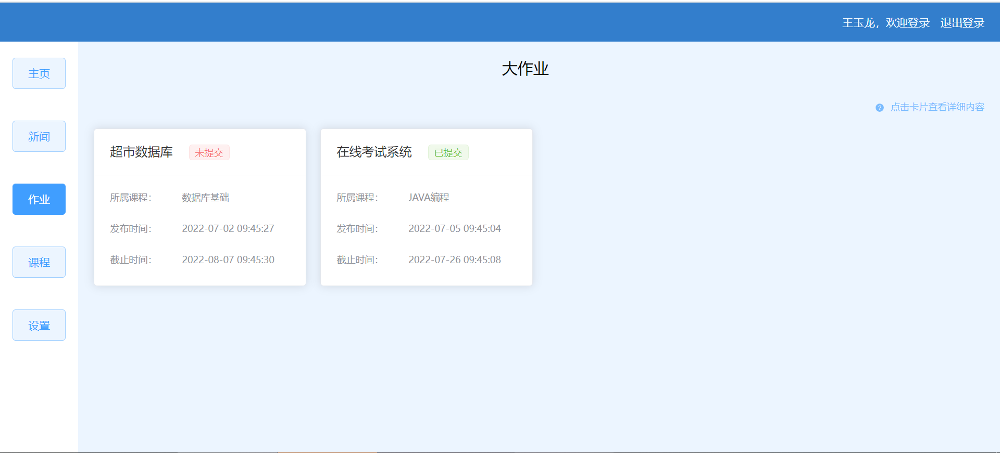

**Figure 5.41 Screenshot of the student\'s homework interface**

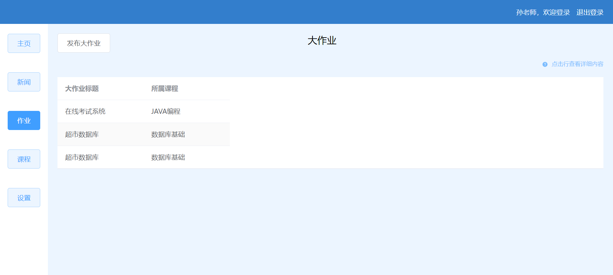

**Figure 5.42 Screenshot of the teacher\'s homework interface**

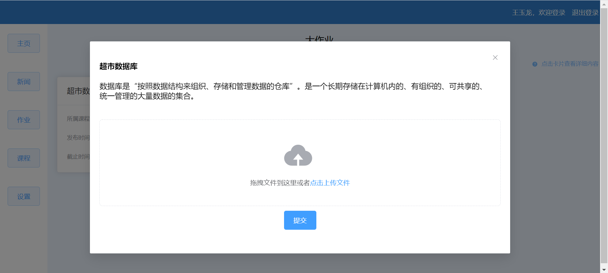

**Figure 5.4Screenshots of the 3 major job submission interfaces**

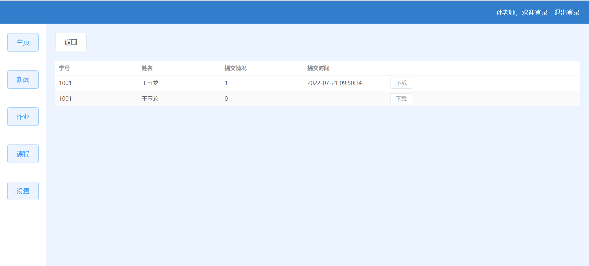**Figure 5.4Screenshot of the interface of
the details of the 4 major jobs**

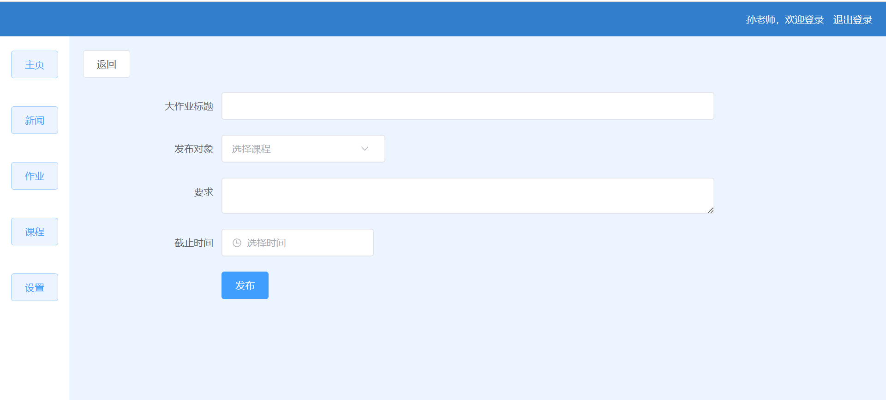

**Figure 5.4.5 Screenshot of the big job release page**

## Course management interface 

The course management module is shown in Figure 5.5.1. The information
for each course is presented in the form of a card, showing the course
name, course credits, and course description. The \"Edit Course
Introduction\" button in the upper left corner is only visible to
teacher users and hidden from student users. Clicking on the card will
bring up a pop-up window to show the details of the course, as shown in
Figure 5.5.2. Teachers can modify the course description, as shown in
Figure 5.5.3.

**Figure 5.51 Screenshot of the course management interface**

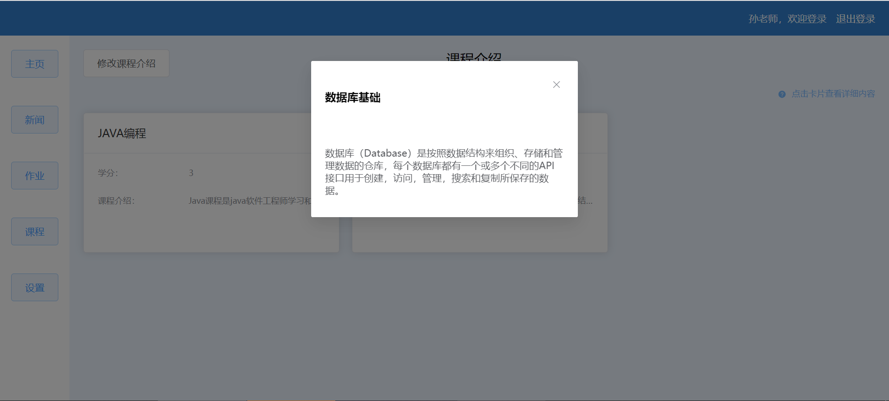

**Figure 5.52 Screenshot of the course management pop-up window**

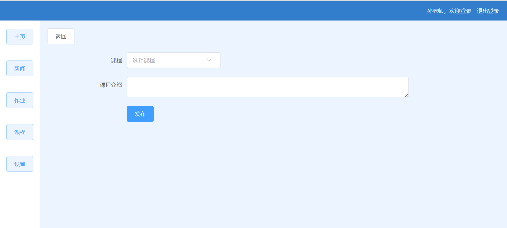

**Figure 5.53 Screenshot of the modified interface for course introduction**

## Account management interface 

Figure 5.11 shows the account management module. Users can change the
password by entering the password twice and clicking the OK button.

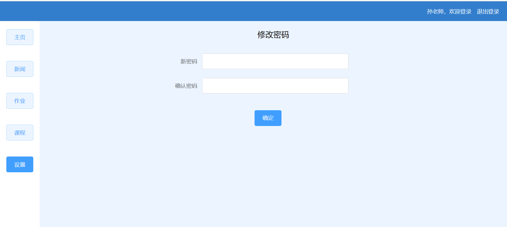

**Figure 5.11 Screenshot of the account management interface**
